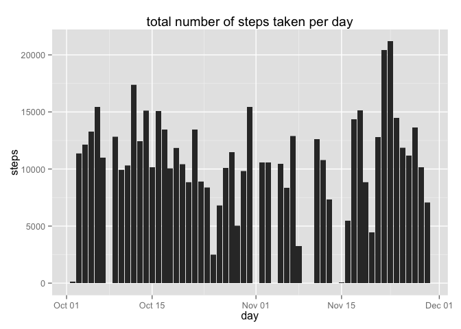
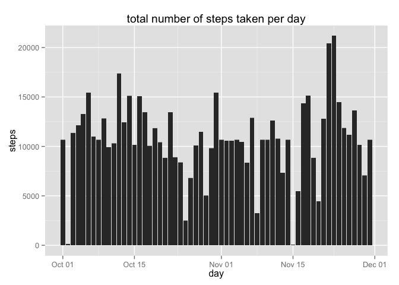
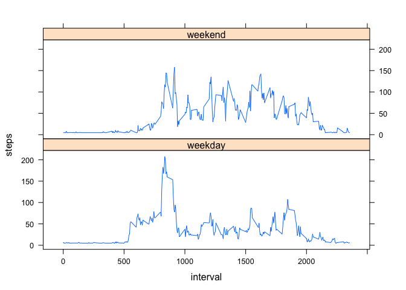

# Reproducible Research: Assignment 1

# Introduction
It is now possible to collect a large amount of data about personal movement 
using activity monitoring devices such as a Fitbit, Nike Fuelband, or Jawbone Up. 
These type of devices are part of the "quantified self" movement -- a group of 
enthusiasts who take measurements about themselves regularly to improve their 
health, to find patterns in their behavior, or because they are tech geeks. 
But these data remain under-utilized both because the raw data are hard to 
obtain and there is a lack of statistical methods and software for processing 
and interpreting the data.

This report makes use of data from a personal activity monitoring device. 
This device collects data at 5 minute intervals through out the day. 
The data consists of two months of data from an anonymous individual collected 
during the months of October and November, 2012 and include the number of steps 
taken in 5 minute intervals each day.

# Data

The data for this assignment can be downloaded from the web:

* Dataset: [Activity monitoring data](https://d396qusza40orc.cloudfront.net/repdata%2Fdata%2Factivity.zip)

The variables included in this dataset are:

* steps:    Number of steps taking in a 5-minute interval (missing values are coded as NA)
* date:     The date on which the measurement was taken in YYYY-MM-DD format
* interval: Identifier for the 5-minute interval in which measurement was taken

The dataset is stored in a comma-separated-value (CSV) file and there are a 
total of 17,568 observations in this dataset.

# **REPORT**
  
  

## Loading and preprocessing the data
1. Load the data

```r
# path to zipfile
zip <- file.path(getwd(), "activity.zip")

#unzip and read csv
data <- read.csv(unz(zip, "activity.csv"),
                     header=T,
                     sep=",",
                     na.strings="NA",
                     colClasses = c("integer", "Date", "integer"),
                     stringsAsFactors = FALSE)
# delete unzipped csv
unlink("*.csv")

# display head of data
head(data)
```

```
##   steps       date interval
## 1    NA 2012-10-01        0
## 2    NA 2012-10-01        5
## 3    NA 2012-10-01       10
## 4    NA 2012-10-01       15
## 5    NA 2012-10-01       20
## 6    NA 2012-10-01       25
```

2. Process/transform the data (if necessary) into a format suitable for your analysis - **Not applicable**

## What is mean total number of steps taken per day?
1. Calculate the total number of steps taken per day

```r
# remove missing values from analysis data
real_data <- na.omit(data)
library("dplyr")
```

```
## 
## Attaching package: 'dplyr'
## 
## The following object is masked from 'package:stats':
## 
##     filter
## 
## The following objects are masked from 'package:base':
## 
##     intersect, setdiff, setequal, union
```

```r
by_date <- group_by(real_data, date)
summary <- summarise(by_date, num_steps = sum(steps))
```

```r
head(summary)
```

```
## Source: local data frame [6 x 2]
## 
##         date num_steps
## 1 2012-10-02       126
## 2 2012-10-03     11352
## 3 2012-10-04     12116
## 4 2012-10-05     13294
## 5 2012-10-06     15420
## 6 2012-10-07     11015
```
2. Make a histogram of the total number of steps taken each day

```r
real_data$month <- as.numeric(format(real_data$date, "%m"))

library(ggplot2)
ggplot(real_data, aes(date, steps)) +
    geom_bar(stat = "identity") +
    labs(title = "total number of steps taken per day",  x = "day",  y = "steps")
```

 
3. Calculate and report the mean and median total number of steps taken per day

```r
mean_a <- mean(summary$num_steps)
median_a <- median(summary$num_steps)
```
**mean:** 10766 and **median:** 10765  

## What is the average daily activity pattern?
1. Make a time series plot of the 5-minute interval and the average number of 
steps taken, averaged across all days

```r
by_interval <- group_by(real_data, interval)
summary <- summarise(by_interval, mean_steps = mean(steps))
head(summary)
```

```
## Source: local data frame [6 x 2]
## 
##   interval mean_steps
## 1        0  1.7169811
## 2        5  0.3396226
## 3       10  0.1320755
## 4       15  0.1509434
## 5       20  0.0754717
## 6       25  2.0943396
```

```r
plot(as.integer(as.character(summary$interval)), 
     summary$mean_steps, 
     xlab = "day",  
     ylab = "steps",
     type="l")
```

 
2. Which 5-minute interval, on average across all the days in the dataset, 
contains the maximum number of steps?

## Imputing missing values
1. Calculate and report the total number of missing values in the dataset 

```r
sum(is.na(data))
```

```
## [1] 2304
```

2. Devise a strategy for filling in all of the missing values in the dataset. - **mutate data**

3. Create a new dataset that is equal to the original dataset but with the 
missing data filled in.

```r
full_data <- mutate(data, 
              steps = ifelse(is.na(steps), as.integer(mean(steps, na.rm = T)), steps))
head(full_data)
```

```
##   steps       date interval
## 1    37 2012-10-01        0
## 2    37 2012-10-01        5
## 3    37 2012-10-01       10
## 4    37 2012-10-01       15
## 5    37 2012-10-01       20
## 6    37 2012-10-01       25
```

4. Make a histogram of the total number of steps taken each day and Calculate 
and report the mean and median total number of steps taken per day. 

```r
#histogram
ggplot(full_data, aes(date, steps)) +
    geom_bar(stat = "identity") +
    labs(title = "total number of steps taken per day",  x = "day",  y = "steps")
```

 

```r
#total number of steps taken each day
by_date <- group_by(full_data, date)
summary <- summarise(by_date, num_steps = sum(steps))
head(summary)
```

```
## Source: local data frame [6 x 2]
## 
##         date num_steps
## 1 2012-10-01     10656
## 2 2012-10-02       126
## 3 2012-10-03     11352
## 4 2012-10-04     12116
## 5 2012-10-05     13294
## 6 2012-10-06     15420
```

```r
#mean and median
mean_b <- mean(summary$num_steps)
median_b <- median(summary$num_steps)
```

Do these values differ from the estimates from the first part of the assignment?

* Part 1: **mean:** 10766 and **median:** 10765
* Part 2: **mean:** 10751 and **median:** 10656

What is the impact of imputing missing data on the estimates of the total 
daily number of steps?

```r
abs(mean_a - mean_b)
```

```
## [1] 14.45097
```

```r
abs(median_a - mean_b)
```

```
## [1] 13.2623
```

## Are there differences in activity patterns between weekdays and weekends?
1. Create a new factor variable in the dataset with two levels – 
“weekday” and “weekend” indicating whether a given date is a weekday or 
weekend day.

```r
full_data$weekdays <- factor(format(full_data$date, "%A"))  

levels(full_data$weekdays) <- 
  list(
    weekday = c("Monday", "Tuesday","Wednesday","Thursday", "Friday"),
    weekend = c("Saturday", "Sunday")
  )  
head(full_data)
```

```
##   steps       date interval weekdays
## 1    37 2012-10-01        0  weekday
## 2    37 2012-10-01        5  weekday
## 3    37 2012-10-01       10  weekday
## 4    37 2012-10-01       15  weekday
## 5    37 2012-10-01       20  weekday
## 6    37 2012-10-01       25  weekday
```

2. Make a panel plot containing a time series plot of the 
5-minute intervaland the average number of steps taken, averaged 
across all weekday days or weekend days. 

```r
by_interval <- group_by(full_data, interval, weekdays)
summary <- summarise(by_interval, mean_steps = mean(steps))
head(summary)
```

```
## Source: local data frame [6 x 3]
## Groups: interval
## 
##   interval weekdays mean_steps
## 1        0  weekday   6.955556
## 2        0  weekend   4.625000
## 3        5  weekday   5.333333
## 4        5  weekend   4.625000
## 5       10  weekday   5.088889
## 6       10  weekend   4.625000
```

```r
library(lattice)
xyplot(summary$mean_steps ~ summary$interval | summary$weekdays, 
       layout = c(1, 2), type = "l", 
       xlab = "interval", ylab = "steps")
```

 
